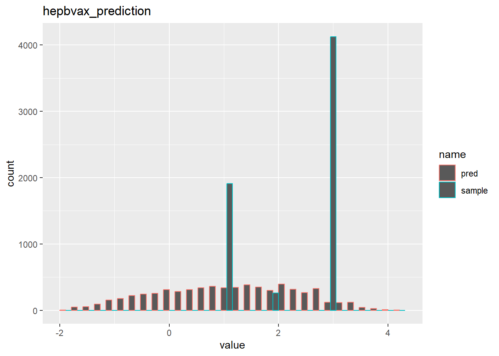

Here is a group from class P8105: Data Science. In this website you can find our final project research.

Our group members are all from Columbia University. You can find more information about us from this [link](about.html) or by clicking on the About tab above.

## Abstract ##
Even though it can be effectively prevented by vaccine, [Hepatitis B](https://www.cdc.gov/hepatitis/hbv/index.htm) currently is still a significant public health concern. Infants are at high risk of developing a chronic infection from HBV if they get infected with the virus, whereas only 2%-6% of adults who get infected with the virus may get chronically infected. The best way to prevent HBV is to get vaccinated [[1](https://www.cdc.gov/hepatitis/hbv/index.htm)]. As it is obvious that Hepatitis B vaccination rates vary in different communities, our group would like to find what factors can be statistically significantly related to an individuals' Hepatitis B vaccination status. Data related to vaccination status was extracted from the [CDC's National Health and Nutrition Examination Survery (NHANES) website](https://wwwn.cdc.gov/Nchs/Nhanes/2017-2018/P_HIQ.htm) from 2017 to pre-COVID March 2020 and cleaned. A logistic regression model was built to explore the relationship of hepatitis B vaccination status with a variety of factors, including age, gender, race, education level, and insurance coverage. The final result showed that all of these variables were significantly associated with Hepatitis B vaccination status. The model obtained was: __model = glm(formula = hepbvax ~ agecrude + gender + race + educat + insany, family = binomial())__. Our results suggest a need to consider the impact of these factors when designing hepatitis B vaccination programs to ensure equitable vaccination outreach and effective hepatitis B prevention.

## Introduction ##
### Motivation ###
The Hepatitis B virus caused an estimated total of 21,600 cases of acute infection in the United States in 2018 [[2](https://www.cdc.gov/hepatitis/hbv/hbvfaq.htm#overview)]. Thanks to the Hepatitis B vaccine, the ratio of new HBV infections in the United States has maintained constantly around 1 reported cases per 100 thousand individuals in the population from 2011 to 2018 [[2](https://www.cdc.gov/hepatitis/hbv/hbvfaq.htm#overview)]. However, there are still 880 thousand to 1.89 million people living with HBV infection, two thirds of whom are estimated to not even know that they are infected [[3](https://pubmed.ncbi.nlm.nih.gov/34097776/),[4](https://pubmed.ncbi.nlm.nih.gov/33655536/)]. 

The negative impact of this disease is not spread evenly. For instance, people born outside of the United States, who account for 14% of the US general population, account for 69% of the US population living with chronic HBV infection. This reminds us that HBV infection may vary greatly across different communities [[2](https://www.cdc.gov/hepatitis/hbv/hbvfaq.htm#overview)].

HBV can be transmitted via activities involving percutaneous or mucosal contact with body fluids. Thus, sex, injection and blood contact are  major routes of transmission. It is possible for an infant to have HBV infection from mother by giving birth [[2](https://www.cdc.gov/hepatitis/hbv/hbvfaq.htm#overview)]. The virus can remain infectious outside the body for at least 7 days [[5](https://pubmed.ncbi.nlm.nih.gov/6111645/)]. 

After being infected with hepatitis B, most children younger than 5 years old and newly infected immunosuppressed adults do not experience symptoms. However, around 30% to 50% of people older than 5 years old who are infected with acute hepatitis B may experience symptoms such as fever, fatigue, nausea, and joint pain [[6](https://pubmed.ncbi.nlm.nih.gov/18096267/)]. If the infection becomes chronic, most people will not experience symptoms, but some may develop hepatitis, cirrhosis, or hepatocellular carcinoma [[2](https://www.cdc.gov/hepatitis/hbv/hbvfaq.htm#overview)].

In order to prevent HBV, Hepatitis B Vaccination is the best method [[7](https://www.cdc.gov/mmwr/volumes/67/rr/rr6701a1.htm)]. It is recommended that people from all age ranges receive vaccination. In the United States, the hepatitis B vaccine is typically given to infants as part of the routine childhood vaccination schedule. The optimal hepatitis B vaccination schedule consists of three doses of the vaccine, with the second dose administered one month after the first dose and the third dose given six months after the first dose. This schedule is recommended by the Centers for Disease Control and Prevention (CDC) and is considered the most effective way to prevent hepatitis B infection.

A hepatitis B booster series is typically given to individuals who have previously been vaccinated against hepatitis B but have lost their immunity to the disease. This can happen over time, especially in individuals who have weakened immune systems due to conditions such as HIV infection or cancer. In these cases, a booster series of hepatitis B vaccine can help to restore immunity to the disease and protect against infection.

Ideally, individuals should receive three doses of hepatitis B vaccine to provide the best protection against infection. However, according to a report from the Centers for Disease Control and Prevention (CDC), only 40.3% of adults aged 19 to 49 years and 19.1% of adults aged over 50 years received three or more doses of the vaccine [[8](https://www.cdc.gov/vaccines/acip/recs/grade/hepb-adults-etr.html)]. Our group is interested in researching the factors that may be significantly associated with vaccination status in order to develop new policies that could help to increase vaccination rates. By focusing on these factors, it may be possible to raise the hepatitis B vaccination rate and protect more individuals from this potentially serious disease.

In addition to a commitment to leveraging open source data, we also wanted to demonstrate accessibility of research for lay members of the public. To do this, a dashboard was created for a dynamic way of interfacing with the data. Predictors included in the original dataset (but not necessarily in the final model) are available so one could view variations in vaccination of Hepatitis B across different parameters: age (10 year span and 1 year span), insurance coverage status, sex, race, and education. Important for the public to note is that the way the data was loaded corresponds with the way that the NHANES study initially categorized (for example) race and ethnicity variables.

### Related Work ###

Hepatitis vaccination rates can vary among different communities based on factors such as age, gender, socioeconomic status, race, and insurance status. For example, older individuals may have higher vaccination rates compared to younger individuals because they are more likely to have received the vaccine as part of routine childhood vaccination programs. Additionally, certain racial and ethnic minority groups may have lower vaccination rates due to lower access to healthcare and other barriers. Socioeconomic status can also play a role, as individuals with lower incomes may have lower vaccination rates due to lack of access to healthcare and other resources.

Prior scholarship has extensively documented a relationship between socioeconomic factors and vaccination rates. For instance, one recent study in the United States found that racial disparities in COVID-19 vaccination rates were associated with median income, disparity in high school education, and vote share for the Republican party in the 2020 presidential election [[9](https://www.pnas.org/doi/full/10.1073/pnas.2107873118)]. An unpublished CDC analysis of data from the National Health Interview Survey (NHIS) found that Black and Hispanic race/ethnicity were both associated with lower vaccination rates [[8](https://www.cdc.gov/vaccines/acip/recs/grade/hepb-adults-etr.html)]. This relationship was found to be statistically significant.

Looking at hepatitis in particular, one study from 2022 used claims based data on 356,828 adults ≥19 years old who were continuously enrolled in a medical benefit plan to examine adherence and completion rates for hepatitis A and B vaccination schedules [[10](https://www.ncbi.nlm.nih.gov/pmc/articles/PMC8853527/)]. The authors used logistic regression analysis to conclude that lower adherence and completion rates were broadly associated with male gender, younger age, Black or Hispanic race/ethnicity, lower educational or household income attainment, and medical comorbidities. Clearly, much remains to be done to ensure disparities in who receives hepatitis B vaccination are eventually eradicated.

### Initial Questions ###
Our original question was focused on how health insurance related to Hepatitis B vaccination status. Specifically, was insurance coverage associated with changes in Hepatitis B vaccination status? And how might that association be affected by demographic factors, such as age, gender, race, and socioeconomic status?

## Data and Exploratory Analysis ## 
Raw data was obtained from the [CDC's National Health and Nutrition Examination Survery website](https://wwwn.cdc.gov/Nchs/Nhanes/2017-2018/P_HIQ.htm). This data was chosen due to its open source nature and because one group member has previously utilized this data set to explore research interests in a different area. The NHANES collects data on a variety of health-related topics, including vaccination rates, through surveys and physical examinations of a representative sample of the US population. This data can be used to identify trends and disparities in vaccination rates among different groups. To conduct our study, the data set was extracted and cleaned per the following description.

All the data files were saved in our github folder, and you can visit them via [https://github.com/Meltaria/8105_FP_YH_HM_JM_MD.github.io.git](https://github.com/Meltaria/8105_FP_YH_HM_JM_MD.github.io.git). The file, __nhanes__, is the data frame containing all these six distinct data files. You may taken a close look about the detailed procedure of [data cleaning](data_cleaning.html).

These six data sets include Alcohol Use, Demographics, Hepatitis, Health Insurance, Immunization and Income. All the duplicated data was eliminated and only the data from those, who are 18 years and older, was selected for our cohort. 

After plotting the individual's age, we found that people who were older than 80 years old were classified as 80 years old. We explored multiple potential methods of solving this issue.

We have two primary methods. One was to categorize age into deciles, for 0 to 9, 10 to 19 and so on. Those individuals with high age would be classified in to 80+. Another one was to categorize the age into quartiles. People were classified into four groups: younger than 25 years, 25 to 49 years, 50 to 74 years, and over 75 years old.

All the missing data were eradicated. The descriptive variables' numeric labels were relabeled and added character descriptions. For gender, we relabeled them as 1 to be male and 0 to be female. The race variables were labeled from 0 to 5, as Mexican American, Other Hispanic, Non-Hispanic White, Non-Hispanic Black, Non-Hispanic Asian and Other Race, including Multi-Racial. We also categorized the Family Monthly Poverty Level index as a binary outcome where ratios smaller than 5 would be categorized as 0 while those equal or larger than 5 would be labelled as 1. The education category was also reorganized. The missing data and refused people were labeled as NA and eradicated. 9th to 11th grade (or no diploma) and high school grad or GED were merged into a new category: "High school/GED". Other groups maintained same or renamed: lower than 9th grade, College and College Grad+. 

The individual's Hepatitis Histories were also cleaned. For both Hepatitis B and Hepatitis C, only Yes and No were preserved. Refused and Don't known would be labelled as NA and eradicated with missing data. Similar process was done to the Health insurance Coverage, containing only Yes and No. The data of heptatitis B Vaccination Status were also included as Immunization Status. Excluding refused, don't known and missing data, we preserved at least three doses, less than three doses and no doses. 

In the end, we restricted the data frame to include those individuals we were interested in analyzing. A table was included to describe how many individuals were excluded and why. Our final data set included 6,298 individuals with an average age of 52 years. 

## Linear Regression Analysis ## 

You can find detailed linear regression procedure [here](linear-regression.html).

The  data set, __nhanes__, contains 11 variables in total. 
  __agecrude__: age in years at screening
  
  __age_decile__: categorize age in every 10 years, including: "0-9", "10-19", "20-29", "30-39", "40-49", "50-59", "60-69", "70-79", "80+"
  
  __age_quartile__: categorize age in every 25 years, including: "<25 years", "25-49 years", "50-74 years", "≥75 years"
  
  __gender__: the individual's sex, including "Female" and "Male"
  
  __race__: the individual's race, including "Mexican American", "Other Hispanic", "Non-Hispanic White", "Non-Hispanic Black", "Non-Hispanic Asian", "Other/Multi-Racial"
  
  __poverty__: binary outcome of poverty index, including "Index of 0-4.99", "Index >=5"
  
  __educat__: individual's education level, including "<9th grade", "High school/GED", "College", "College Grad+"
  
  __insany__: if insurance covered, including "No", "Yes"
  
  __hepb__: Hepatitis B history, including "No History of Hepatitis B", "History of Hepatitis B"
  
  __hepc__: Hepatitis C history, including "No History of Hepatitis C", "History of Hepatitis C"
  
  __hepbvax__: Hepatitis B vaccination history, including "At Least Three Doses", "Less Than Three Doses", "No Doses"

The variables were paired and plotted. Based on the plots, we can find that, most of the variables were normal so no transformation may be required.

As there are 3 age variables and we only need one variable included in the model, three logistic regression models were built based on different age variables. 

Automatic selection was used to find models with age_decile, age_quartile and agecrude. Both backward elimination and forward selection were processed. Comparing the selection of the models, the AIC of agecrude's model is slightly smaller than that of age_deciles and age_quartiles. Thus, we choose agecrude as our age variable in the model.

The models we obtained from the backward elimination and forward selection are different.
__fitback = glm(formula = hepbvax ~ agecrude + gender + race + educat + insany, family = binomial(), data = nhanes_crude)__ for backward elimination and __fitfor = glm(formula = hepbvax ~ agecrude + gender + race + poverty + educat + insany + hepb + hepc, family = binomial(), data = nhanes_crude)__ for forward selection. Fitfor has three more predictors included, poverty, hepb, and hepc, than fitback. Further procedure should be done to choose one of the models. 

We labeled fitback as the small model "fit_small" and fitfor as the large model "fit_large", as the fit_large simply had three more predictors than fit_small. 
We set the null hypothesis H0 that: poverty, hepb and hepc are not statistically significant to the model and the alternative hypothesis H1 that: poverty, hepb and hepc are statistically significant to the model.

Anova for logistic regression was used to compare these two models. The p-value is 0.3299, larger than 0.05. Thus, we failed to reject the null hypothesis and concluded that the larger model was not superior. Thus the small model was chosen. Our model showed to be __model = glm(formula = hepbvax ~ agecrude + gender + race + educat + insany, family = binomial(), data = nhanes_crude)__. 

This is a virtual test of the prediection power of our linear regression model.

However, after tests, we were not satisfied the prediction power of our linear regression model. We concluded it was because linear regression didn't fit our data too well. Therefore, we decided to adopt the multinomial logistic regression model with the same predictors. The model we obtained was __multinom(formula = hepbvax ~ agecrude + gender + race + educat + insany,  data = nhanes_crude)__.

While we tried to show the prediction power of our new model, an interesting question came to our mind: is there a relationship between age_crude and the prediction power of our model? We organized the data, and made some calculations. The final graph answered this question: for people older than 40, the accuracy rises as the age increases.

## Discussion ##
Our final model showed that the age, gender, race, education level and insurance coverage are significantly associated with vaccination status. 

The "agecrude" and "genderMale" terms have positive estimate coefficients of 0.063 and 0.535, respectively. It indicates that older people may be more likely take vaccination than younger ones and males may be more willing to take vaccination than females. These two terms' p-values are extremely small, lower than 0.001, indicating they are significantly associated with vaccination status.

The "race" predictor was negative for all its terms' estimate coefficients. Black race has the largest coefficient to be -0.118, which could suggest Black individuals might be more likely to be vaccinated against Hepatitis B than individuals of other races, comparing Hispanics' -0.433, Whites' -0.345, and Asians' -0.496. However, Black race also has the p.value 0.328, much larger than 0.05, indicating Black Race, similar to the Multi-Racial category, is not associated with vaccination status at a statistically significant level. Asian race has the largest magnitude of a decrease in probability of being vaccinated, compared with other races that demonstrated statistically significant associations with vaccination status.

According to the estimated coefficient for education, it looks like that people with higher education level are less likely to take vaccination. People with higher education level plays a more significant role in vaccination conditions according to their p-values smaller than 0.001. 

It is also surprising that even with insurance coverage, people are still less likely to take vaccination as the estimated coefficient is -0.494. With such a large effect size and a p-value smaller than 0.001, it showed us that insurance coverage is still an important factor for vaccine uptake. 

The original dataset contained multiple variables that ultimately were not included in the cleaned dataset. Additionally issues with how the data was coded was conducive to having varied missing data or incomplete data, leading to limited ability to incorporate granularity in the data. For example, there were multiple missing data responses for the different insurance types including Medicare. Race and ethnicity were also conflated in the data collection; further cleaning may have lent itself to difficulty This may have been an important but not considered correlate in the positive findings for age; among those variables not included were alcohol abuse which through a behavioral mechanism pathway may have been ultimately considered. As such, the final dataset upon which modeling and the linear regression may not have been refined. As the data was collected from 2017 up until the pandemic onset (March 2020), it may have limited generalizability to present-day factors. 

## Conclusion ##
From the model we obtained in this research, we are able to find which variables can be significantly associated with Hepatitis B vaccination status. Age, gender, race, education level and insurance coverage are each associated with Hepatitis B vaccination status. In the future, more detailed research can be done by focusing on the mechanisms of this association. Additionally, researchers should examine how potential public health policies, such as changing the vaccine schedule from 3 doses to 2 doses, may impact individuals' likelihood of getting vaccinated.

## Acknowledgements ## 
Thank you to Professor Goldsmith, our group TA Paula Wu and all TAs as well as to NHANES researchers, collaborators, and participants. 

## References ## 
1. Centers for Disease Control and Prevention. (2021, October 12). Hepatitis B - faqs, Statistics, data, &amp; guidelines. Centers for Disease Control and Prevention.  https://www.cdc.gov/hepatitis/hbv/index.htm 

2. Centers for Disease Control and Prevention. (2022, March 30). Hepatitis B questions and answers for Health Professionals. Centers for Disease Control and Prevention. https://www.cdc.gov/hepatitis/hbv/hbvfaq.htm#overview 

3. Roberts, H., Ly, K. N., Yin, S., Hughes, E., Teshale, E., & Jiles, R. (2021). Prevalence of HBV Infection, Vaccine-Induced Immunity, and Susceptibility Among At-Risk Populations: US Households, 2013-2018. Hepatology (Baltimore, Md.), 74(5), 2353–2365. https://doi.org/10.1002/hep.31991

4. Wong, R. J., Brosgart, C. L., Welch, S., Block, T., Chen, M., Cohen, C., Kim, W. R., Kowdley, K. V., Lok, A. S., Tsai, N., Ward, J., Wong, S. S., & Gish, R. G. (2021). An Updated Assessment of Chronic Hepatitis B Prevalence Among Foreign-Born Persons Living in the United States. Hepatology (Baltimore, Md.), 74(2), 607–626. https://doi.org/10.1002/hep.31782

5. Bond, W. W., Favero, M. S., Petersen, N. J., Gravelle, C. R., Ebert, J. W., & Maynard, J. E. (1981). Survival of hepatitis B virus after drying and storage for one week. Lancet (London, England), 1(8219), 550–551. https://doi.org/10.1016/s0140-6736(81)92877-4

6. Fattovich, G., Bortolotti, F., & Donato, F. (2008). Natural history of chronic hepatitis B: special emphasis on disease progression and prognostic factors. Journal of hepatology, 48(2), 335–352. https://doi.org/10.1016/j.jhep.2007.11.011

7. Schillie S, Vellozzi C, Reingold A, et al. Prevention of Hepatitis B Virus Infection in the United States: Recommendations of the Advisory Committee on Immunization Practices. MMWR Recomm Rep 2018;67(No. RR-1):1–31. DOI: http://dx.doi.org/10.15585/mmwr.rr6701a1

8. Centers for Disease Control and Prevention. (2022, March 30). Evidence to recommendations for hepatitis B (HEPB) vaccine in adults. Centers for Disease Control and Prevention.  https://www.cdc.gov/vaccines/acip/recs/grade/hepb-adults-etr.html 

9. Agarwal, R., Dugas, M., Ramaprasad, J., Luo, J., Li, G., &amp; Gao, G. (G. (2021). Socioeconomic privilege and political ideology are associated with racial disparity in covid-19 vaccination. Proceedings of the National Academy of Sciences, 118(33). https://doi.org/10.1073/pnas.2107873118 

10. LaMori, J., Feng, X., Pericone, C. D., Mesa-Frias, M., Sogbetun, O., & Kulczycki, A. (2022). Hepatitis vaccination adherence and completion rates and factors associated with low compliance: A claims-based analysis of U.S. adults. PloS one, 17(2), e0264062. https://doi.org/10.1371/journal.pone.0264062

